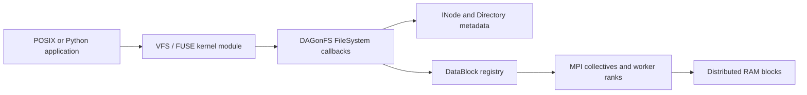

# Architecture

## Purpose and design boundary

DAGonFS is an in-memory FUSE filesystem with MPI-backed data distribution. It offers two deployment models.

| Model | FUSE process | Data coordination |
| --- | --- | --- |
| Client-server | Rank 0 mounts the filesystem. | Rank 0 distributes block work to storage ranks. |
| Peer-to-peer | Every rank mounts a rank-specific directory. | Peers broadcast metadata requests and exchange blocks collectively. |

The design targets workflow scratch data: it trades persistence for low-latency namespace operations and distributed RAM bandwidth. It is therefore appropriate when an application can regenerate or explicitly export its outputs, and inappropriate as the sole location for irreplaceable data.

## Data and control planes

Metadata is represented by `INode` subclasses (`File`, `Directory`, `SymbolicLink`, and `SpecialINode`). Directories map a name to an inode; inode attributes hold ownership, mode, timestamps, link count, and logical file size. File payload is split into fixed-size `DataBlock` objects. Each block records its owning inode, ordinal, byte offset, rank, and in-memory address.

The FUSE request path is the control plane. A kernel operation such as `open`, `write`, or `rename` enters `src/*/include/ramfs/FileSystem.cpp`, validates the namespace and inode state, then replies through the FUSE low-level API. The MPI path is the data plane. The client-server implementation uses `MasterProcessCode` and `NodeProcessCode`; the peer-to-peer implementation uses `DistributedCode` and `RequestSender`.

The registered FUSE callbacks are intentionally mirrored across the two source trees. A semantic change to one variant should normally be applied to the other and exercised by the same source-contract tests.

## I/O lifecycle

For a write, DAGonFS extends the logical file size as necessary, partitions the payload into blocks, and uses MPI communication to place data on participating ranks. A read follows the inverse path: it identifies the required blocks, gathers their contents, and returns the requested byte range through a FUSE reply. The block registry avoids creating entries during read-only status queries, which prevents metadata growth caused by failed or speculative lookups.

Namespace changes are metadata-first operations. `create`, `mkdir`, `mknod`, `symlink`, and `link` reject an existing destination with `EEXIST`; `unlink` and `rmdir` remove directory names and defer inode reclamation until FUSE lookup references are released.

## Consistency and failure model

The mountpoint is volatile: all metadata and file contents disappear when the process exits or the mount is removed. `fsync` and `fsyncdir` therefore acknowledge ordering within the in-memory service; they do not make data durable on a local disk. MPI ranks are part of the service state: a rank failure can make corresponding blocks inaccessible. DAGonFS does not currently implement replication, write-ahead logging, or crash recovery.

This distinction matters for experimental interpretation. A successful `fsync` measures completion of the in-memory service operation, not a durable persistence barrier. Compare DAGonFS against a RAM-backed or network filesystem only after stating the durability and failure assumptions of each system.
